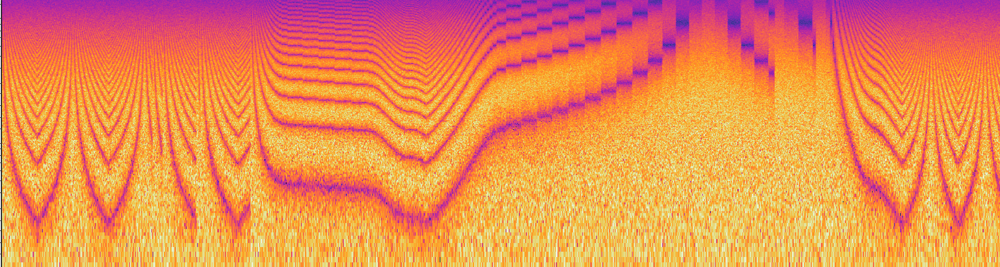

Flanged Noise Effect
====================





What is this
------------

This is a simple sound generator simulating the sound of white noise going through [flanger effect](https://www.youtube.com/shorts/k-efYklAa5Q). The effect runs on attiny13a and it sounds something like this:

https://github.com/user-attachments/assets/f84d3d1d-f7e5-4471-ae4a-dddf72bf2049

(if it doesn't work then check [example.mp3](example.mp3).)

It has two controls:
- button that synchronizes the two noise generators and creates the "jet plane overhead" sound
- a potentiometer that controls how fast do the two noise generators go out of phase (flange speed)

How to build this
-----------------

You will need:
- attiny13a chip
- something to flash the chip with (usb-asp comes to mind)
- button, potentiometer, couple of resistors, couple of capactiors

First you need to program the chip:
- program low fuses to `0x7a` to set the frequency of the internal oscillator to 9.6 MHz (or run `make fuses`)
- either build the project or get [flanged-noise.hex](flanged-noise.hex)
- program flanged-noise.hex to chip or run `make flanged-noise.prog`

The connect the circuit as shown below. The summing of the two noises is done outside the chip with passive mixer and then filtered to smooth out the PWM. The audio-out is 5 V peak-to-peak, so you might want to divide it down to get line-level.

```
                                                       ▲ 5V 
                                                       │  
                                                       │  
                                                       │  
                            ▲  VCC 5V                  /  
                attiny13a   │                          \  
               ┌───┬──┬───┐ │                          / Potentiometer 10-100K
             ──┼ 1 └──┘ 8 ┼─┘    ┌───────────────────► \
               │          │      │                     /  
  button     ──┼ 2      7 ┼──────┘                     \  
    ──┴──      │          │                audio out   │  
 ┌──     ──────┼ 3      6 ┼──/\/\/\/──────┬───►        │  
 │             │          │               │            │  
─┴─        ┌───┼ 4      5 ┼──/\/\/\/──────┤            │  
 =         │   └──────────┘   10 KOhm     │           ─┴─
          ─┴─                             │            =  
           =                            ──┴──
                                        ──┬── 10nF
                                          │  
                                          │  
                                         ─┴─
                                          =  
```

How does it work
----------------

It's very simple:
- there are two LFSR noise generators that have synchronized phase
- one of the noise generator is clocked by a clock that's a little bit slower than the generating speed
- when the two noise genenerators go out of sync by a pre-set number of samples, they swap and now the other starts lagging behind until they sync up
- the values generated by the two noise generators are fed to PWM which gets filtered & summed outside the chip

Modifications
-------------

- you can add modulation depth knob (variable `target_dropped_samples`)
- you can replace the button with trigger (just make sure that the trigger signal doesn't exceed 5 V)
- you can replace the pot with CV source (again, make sure it's in 0..5 V range)

